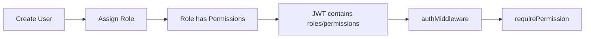
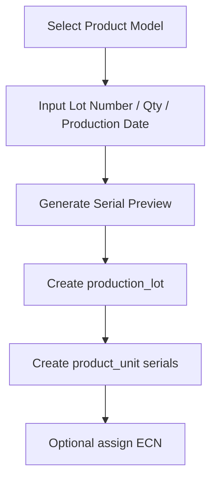
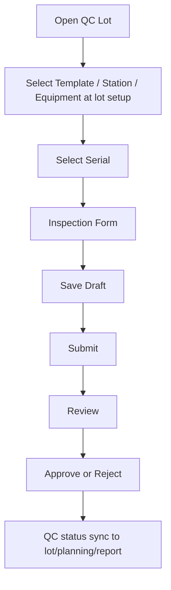
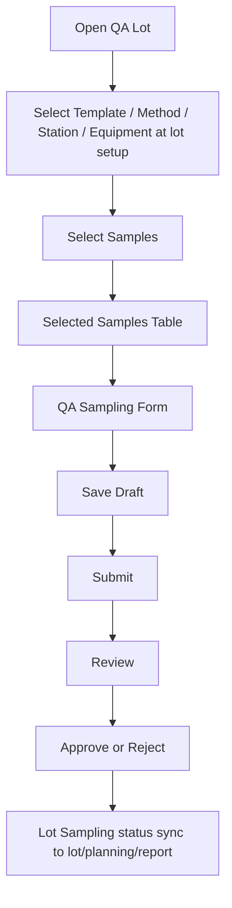
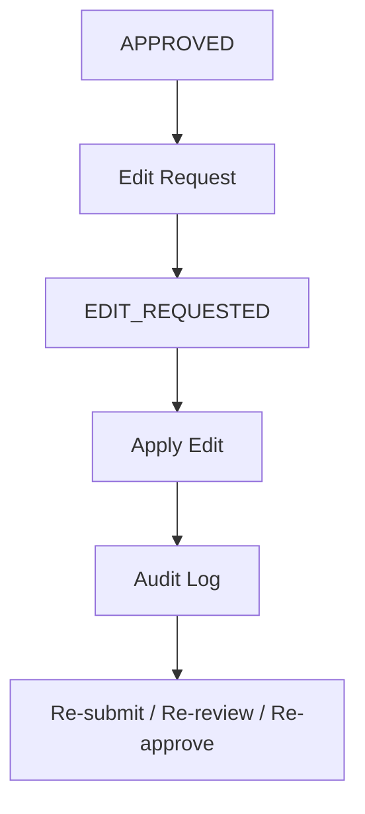
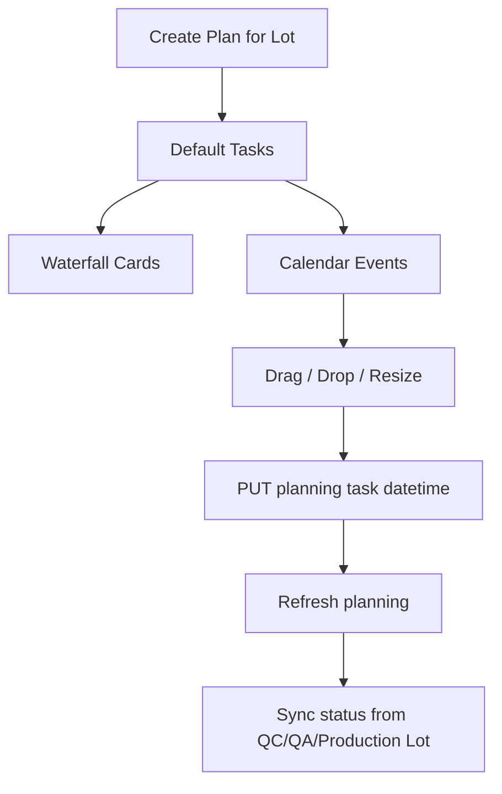

# PMPS Project Handoff

เอกสารนี้ใช้สำหรับส่งต่อ context ของโปรเจกต์ PMPS ให้ developer หรือ ChatGPT account อื่นสามารถเข้าใจ code, database, API และ workflow ปัจจุบันเพื่อพัฒนาต่อได้เร็วขึ้น

## 1. Project Overview

PMPS เป็นระบบ Production / QC / QA / Report สำหรับจัดการ lot การผลิต, serial unit, QC Inspection, QA Sampling, Test Template, Equipment, Planning และ Export report

ระบบปัจจุบันประกอบด้วย:

- Backend API: Node.js / Express
- Database: PostgreSQL
- Migration: `node-pg-migrate`
- Auth: JWT
- Permission: RBAC ผ่าน role / permission
- Frontend: Vite SPA
- Export: CSV / XLSX / PDF
- Planning: Lot Test Planning พร้อม calendar day/week/month และ drag/drop task

เอกสาร API สำหรับ Postman แยกอยู่ที่:

- `Apihelp.md`

## 2. Repository Structure

โครงสร้างหลักของ project:

```text
PMPS/
  server/
    src/
      app.js
      server.js
      config/
      db/
      middlewares/
      modules/
        auth/
        profile/
        users/
        roles/
        products/
        equipment/
        model-required-equipment/
        test-templates/
        production-lots/
        qc-inspections/
        qa-sampling/
        reports/
        exports/
        planning/
        health/
        debug/
    migrations/
    tests/
    package.json

  frontend/
    src/
      main.jsx
      App.jsx
      api/
      components/
      pages/
    package.json

  README.md
  Apihelp.md
  ProjectHandoff.md
```

หมายเหตุ: ชื่อ folder frontend อาจเป็น `frontend` หรือ root app structure ตาม code ปัจจุบัน ให้ตรวจจาก `package.json` ตอนเริ่มงานอีกครั้ง

## 3. Backend Architecture

Backend แบ่งเป็น module ตาม feature โดย pattern หลักคือ:

```text
routes -> controller -> service -> repository -> database
```

โดยทั่วไปแต่ละ module จะมีไฟล์ลักษณะนี้:

```text
*.routes.js
*.controller.js
*.service.js
*.repository.js
*.schema.js
```

หน้าที่แต่ละ layer:

| Layer | Responsibility |
| --- | --- |
| routes | กำหนด endpoint, authMiddleware, requirePermission |
| controller | รับ request, validate, ส่ง response |
| service | business logic, workflow, transaction |
| repository | SQL query และ mapping data |
| schema | validation input |
| middleware | auth, RBAC, error handler, request logging |

## 4. Backend Modules

### Auth

Path:

```text
server/src/modules/auth
```

หน้าที่:

- Login
- Generate JWT
- Get current user
- ดึง role และ permission ของ user

API หลัก:

- `POST /api/auth/login`
- `GET /api/auth/me`

### Profile

Path:

```text
server/src/modules/profile
```

หน้าที่:

- ดูข้อมูล profile ของ user ที่ login
- แก้ไข profile
- เปลี่ยน password

API หลัก:

- `GET /api/profile`
- `PUT /api/profile`
- `POST /api/profile/password`

### Users

Path:

```text
server/src/modules/users
```

หน้าที่:

- จัดการ user
- เปิด/ปิด active
- lock/unlock
- reset password
- assign roles

Permission:

- `UserRole`

API หลัก:

- `GET /api/users`
- `POST /api/users`
- `GET /api/users/:id`
- `PUT /api/users/:id`
- `PATCH /api/users/:id/active`
- `POST /api/users/:id/lock`
- `POST /api/users/:id/unlock`
- `POST /api/users/:id/password`
- `GET /api/users/:id/roles`
- `PUT /api/users/:id/roles`

### Roles / Permissions

Path:

```text
server/src/modules/roles
```

หน้าที่:

- จัดการ role
- ดู permission ทั้งหมด
- assign permission ให้ role

Permission:

- `UserRole`

API หลัก:

- `GET /api/roles`
- `POST /api/roles`
- `GET /api/roles/:id`
- `PUT /api/roles/:id`
- `GET /api/permissions`
- `GET /api/roles/:id/permissions`
- `PUT /api/roles/:id/permissions`

### Product Master

Path:

```text
server/src/modules/products
```

หน้าที่:

- Product Category
- Product Sub Category
- Product Model
- Lookup model

Permission:

- `ProductMaster`

API หลัก:

- `/api/product-categories`
- `/api/product-sub-categories`
- `/api/product-models`
- `/api/lookups/product-models`

### Equipment Master

Path:

```text
server/src/modules/equipment
```

หน้าที่:

- Equipment Type
- Equipment Master
- Calibration status
- Equipment available สำหรับ model

Permission:

- `EquipmentMaster`

API หลัก:

- `/api/equipment-types`
- `/api/equipment`
- `/api/equipment/expired-calibration`

### Model Required Equipment

Path:

```text
server/src/modules/model-required-equipment
```

หน้าที่:

- กำหนดว่า model ใดต้องใช้ equipment type อะไร
- ใช้ตอน QC/QA ตรวจว่า equipment ที่เลือก valid หรือไม่

Permission:

- `ModelRequiredEquipment`

API หลัก:

- `GET /api/model-required-equipment`
- `POST /api/model-required-equipment`
- `PUT /api/model-required-equipment/:id`
- `DELETE /api/model-required-equipment/:id`
- `GET /api/models/:modelId/required-equipment`
- `GET /api/models/:modelId/available-equipment`

### Test Templates

Path:

```text
server/src/modules/test-templates
```

หน้าที่:

- สร้าง test template
- แยก template type เป็น `INSPECTION` และ `QA`
- สร้าง sections/items
- assign template ให้หลาย product model
- duplicate template

Permission:

- `TestTemplate`

Important design:

- `test_template.model_id` ไม่บังคับแล้ว
- ความสัมพันธ์หลาย model ใช้ table `test_template_model`
- 1 template สามารถใช้กับหลาย product model ได้
- มี `is_primary` เพื่อบอก primary model ของ template

API หลัก:

- `/api/test-templates`
- `/api/test-templates/:id/duplicate`
- `/api/test-templates/:id/models`
- `/api/test-templates/:templateId/sections`
- `/api/test-template-sections/:id`
- `/api/test-templates/:templateId/items`
- `/api/test-template-items/:id`

### Production Lots

Path:

```text
server/src/modules/production-lots
```

หน้าที่:

- สร้าง lot
- generate serial
- ดู current lots
- ดู detail และ serials
- update lot qty/status/date/remark
- delete lot พร้อมข้อมูลเกี่ยวข้อง
- assign ECN

Permission:

- `ProductionLot`

API หลัก:

- `GET /api/current-lots`
- `POST /api/production-lots/generate-serials`
- `GET /api/production-lots`
- `POST /api/production-lots`
- `GET /api/production-lots/:id`
- `PUT /api/production-lots/:id`
- `DELETE /api/production-lots/:id`
- `GET /api/production-lots/:id/serials`
- `POST /api/production-lots/:id/ecn`

Important behavior:

- ถ้าเพิ่มจำนวน lot ต้อง generate serial เพิ่ม
- ถ้าลดจำนวน lot ต้องระวัง serial ที่มี QC/QA แล้ว
- delete lot ต้องลบข้อมูล related เช่น serial, QC, QA, planning, ECN ref ตาม cascade/transaction
- production lot status สามารถเปลี่ยนเป็น `COMPLETED` เมื่อ QC/QA workflow ครบตามเงื่อนไข

### QC Inspection

Path:

```text
server/src/modules/qc-inspections
```

หน้าที่:

- QC lot search
- ดู serial ใน lot
- สร้าง inspection draft
- create/update by product_unit_id
- create by `lot_number` + `serial_number`
- workflow: Save Draft -> Submit -> Review -> Approve / Reject
- bulk workflow หลาย serial หรือทั้ง lot
- equipment check
- edit approved result พร้อม audit log

Permission:

- `QCInspection`
- `EditTestResult` สำหรับ edit approved result
- `SearchReport` หรือ `EditTestResult` สำหรับดู edit history

API หลัก:

- `GET /api/qc/lots`
- `GET /api/qc/lots/:lotId/inspection-status`
- `GET /api/qc/lots/:lotId/units`
- `GET /api/qc/models/:modelId/templates`
- `GET /api/qc/templates/:templateId/items`
- `POST /api/qc/inspections`
- `POST /api/qc/inspections/by-serial`
- `POST /api/qc/inspections/bulk-workflow`
- `GET /api/qc/inspections/:id/equipment-check`
- `GET /api/qc/inspections/:id`
- `PUT /api/qc/inspections/:id`
- `POST /api/qc/inspections/:id/submit`
- `POST /api/qc/inspections/:id/review`
- `POST /api/qc/inspections/:id/approve`
- `POST /api/qc/inspections/:id/reject`
- `POST /api/qc/inspections/:id/edit-request`
- `POST /api/qc/inspections/:id/apply-edit`
- `GET /api/qc/inspections/:id/edit-history`

Important behavior:

- API by serial สามารถใช้ `item_code` แทน `template_item_id` ได้
- ถ้า `template_id` เป็น `null` ระบบใช้ template แรกของ model นั้น
- QC Inspection แบบ lot completion ต้องทำครบทุก serial ใน lot จึงถือว่า lot QC completed
- status item/result คำนวณจาก measured value/text เทียบ spec
- ถ้า item ยังไม่ครบ ผลรวมควรเป็น `N/A` ไม่ใช่ `PASS`

### QA Sampling

Path:

```text
server/src/modules/qa-sampling
```

หน้าที่:

- QA lot search
- เลือก sample จาก serial ใน lot
- สร้าง sampling draft
- create by `lot_number` + `serial_number`
- workflow: Save Draft -> Submit -> Review -> Approve / Reject
- equipment check
- edit approved result พร้อม audit log

Permission:

- `QASampling`
- `EditTestResult` สำหรับ edit approved result
- `SearchReport` หรือ `EditTestResult` สำหรับดู edit history

API หลัก:

- `GET /api/qa/lots`
- `GET /api/qa/lots/:lotId/sampling-status`
- `GET /api/qa/lots/:lotId/units`
- `GET /api/qa/models/:modelId/templates`
- `GET /api/qa/templates/:templateId/items`
- `POST /api/qa/samplings`
- `POST /api/qa/samplings/by-serial`
- `GET /api/qa/samplings/:id/equipment-check`
- `GET /api/qa/samplings/:id`
- `PUT /api/qa/samplings/:id`
- `POST /api/qa/samplings/:id/submit`
- `POST /api/qa/samplings/:id/review`
- `POST /api/qa/samplings/:id/approve`
- `POST /api/qa/samplings/:id/reject`
- `POST /api/qa/samplings/:id/edit-request`
- `POST /api/qa/samplings/:id/apply-edit`
- `GET /api/qa/samplings/:id/edit-history`

Important behavior:

- QA Sampling ไม่ต้องทดสอบทุก serial
- ต้อง sample อย่างน้อย 10% ของ lot size และปัดขึ้น
- ถ้า lot size น้อยจน 10% ต่ำกว่า 1 ให้ใช้ขั้นต่ำ 1 ชิ้น
- สามารถ sample มากกว่า 10% ได้
- Lot Sampling status เป็น `APPROVED` ได้เมื่อ sample ที่เลือกผ่าน workflow Approve ตามเกณฑ์
- column `SAMPLES` ใน QA lot search ต้องนับ sample approved/active จริงให้ตรงกับหน้า detail

### Reports

Path:

```text
server/src/modules/reports
```

หน้าที่:

- Dashboard summary
- QC/QA summary
- Lot/Serial/QC/QA reports
- Report detail
- Audit history ใน report detail

Permission:

- `SearchReport`

API หลัก:

- `/api/dashboard/summary`
- `/api/dashboard/qc-summary`
- `/api/dashboard/qa-summary`
- `/api/dashboard/lot-status`
- `/api/reports/lots`
- `/api/reports/serials`
- `/api/reports/qc-inspections`
- `/api/reports/qa-samplings`
- `/api/reports/lots/:lotId`
- `/api/reports/serials/:productUnitId`
- `/api/reports/qc-inspections/:id`
- `/api/reports/qa-samplings/:id`

Important behavior:

- ถ้า QC Inspection และ QA Sampling ของ lot เสร็จ `APPROVED` ครบตามเกณฑ์ ให้ report แสดง lot status เป็น `READY`
- QA total/pass ใน report ต้องนับจาก sampled unit จริง ไม่ใช่จำนวน lot ทั้งหมด
- QC total/pass ต้องนับจาก inspection ของ serial ใน lot

### Exports

Path:

```text
server/src/modules/exports
```

หน้าที่:

- Export CSV/XLSX/PDF สำหรับ QC, QA, Lots, Audit Trail

Permission:

- `SearchReport`

API หลัก:

- `/api/exports/qc-inspections.csv`
- `/api/exports/qc-inspections.xlsx`
- `/api/exports/qc-inspections.pdf`
- `/api/exports/qc-inspections/:id/pdf`
- `/api/exports/qa-samplings.csv`
- `/api/exports/qa-samplings.xlsx`
- `/api/exports/qa-samplings.pdf`
- `/api/exports/qa-samplings/:id/pdf`
- `/api/exports/lots.csv`
- `/api/exports/lots.xlsx`
- `/api/exports/lots/:lotId/pdf`
- `/api/exports/audit-trails.csv`
- `/api/exports/audit-trails.xlsx`

### Planning

Path:

```text
server/src/modules/planning
```

หน้าที่:

- Lot Test Planning
- สร้าง plan ต่อ lot
- สร้าง task เช่น Lot Created, QC Inspection, QC Review, QC Approve, QA Sampling, Report Ready
- sync card status กับ QC/QA status
- calendar day/week/month
- drag/drop task เพื่อเปลี่ยนวันเวลา

Permission:

- View: `PlanningView` หรือ `SearchReport`
- Manage: `PlanningManage`

API หลัก:

- `GET /api/planning/plans`
- `GET /api/planning/plans/:id`
- `POST /api/planning/plans`
- `PUT /api/planning/plans/:id`
- `DELETE /api/planning/plans/:id`
- `POST /api/planning/plans/:id/tasks`
- `PUT /api/planning/tasks/:taskId`
- `DELETE /api/planning/tasks/:taskId`

Important behavior:

- 1 lot มี plan ได้ 1 แผนจาก constraint `UNIQUE(lot_id)`
- task ใช้ datetime ไม่ใช่แค่ date
- planned start/end สามารถเป็นวันเดียวกันได้ ถ้าเวลา end >= start
- Report Ready card ควรเป็น `COMPLETED` เมื่อ Lot Created, QC Inspection, QC Review, QC Approve, QA Sampling เป็น `COMPLETED` หรือ `APPROVED`
- Production Lot status ควรเป็น `COMPLETED` เมื่อ workflow สำคัญครบ

## 5. Database Structure Summary

ตารางหลักแบ่งตาม domain ดังนี้

### Auth / RBAC

| Table | Purpose |
| --- | --- |
| `app_user` | users |
| `app_role` | roles |
| `app_permission` | permissions |
| `app_user_role` | user-role mapping |
| `app_role_permission` | role-permission mapping |

Permission สำคัญ:

- `UserRole`
- `ProductMaster`
- `EquipmentMaster`
- `ModelRequiredEquipment`
- `TestTemplate`
- `ProductionLot`
- `QCInspection`
- `QASampling`
- `SearchReport`
- `EditTestResult`
- `PlanningView`
- `PlanningManage`

### Product Master

| Table | Purpose |
| --- | --- |
| `product_category` | product category |
| `product_sub_category` | sub category |
| `product_model` | product model / SKU |

### Equipment

| Table | Purpose |
| --- | --- |
| `equipment_type` | type เช่น DMM |
| `equipment_master` | equipment asset |
| `model_required_equipment` | required equipment type per model |

### Test Template

| Table | Purpose |
| --- | --- |
| `test_template` | template header |
| `test_template_model` | template assigned to many models |
| `test_template_section` | template section |
| `test_template_item` | test items/spec |

Important columns:

- `test_template.template_type`: `INSPECTION` หรือ `QA`
- `test_template_model.is_primary`: primary model
- `test_template_item.check_type`: `NUMERIC`, `BOOLEAN`, `TEXT`
- `test_template_item.item_code`: ใช้กับ API by serial แทน `template_item_id` ได้

### Production Lot

| Table | Purpose |
| --- | --- |
| `production_lot` | lot header |
| `product_unit` | serial unit in lot |
| `ecn_master` | ECN master |
| `lot_ecn_ref` | lot-ECN mapping |

Important statuses:

- `OPEN`
- `COMPLETED`
- `CLOSED`
- `HOLD`
- `CANCELLED`

### QC Inspection

| Table | Purpose |
| --- | --- |
| `inspection_header` | QC inspection header per unit |
| `inspection_detail` | QC item results |
| `inspection_equipment` | equipment used in QC |

Important statuses:

- `DRAFT`
- `SUBMITTED`
- `REVIEWED`
- `APPROVED`
- `REJECTED`
- `EDIT_REQUESTED`

### QA Sampling

| Table | Purpose |
| --- | --- |
| `qa_sampling_header` | QA sampling header per lot |
| `qa_sample_unit` | sampled serials |
| `qa_sample_detail` | QA item results |
| `qa_sampling_equipment` | equipment used in QA |

Important statuses:

- `DRAFT`
- `SUBMITTED`
- `REVIEWED`
- `APPROVED`
- `REJECTED`
- `EDIT_REQUESTED`

### Audit Trail

| Table | Purpose |
| --- | --- |
| `result_edit_audit_log` | audit for QC/QA approved result edit |

Important columns:

- `source_type`: `QC` หรือ `QA`
- `source_id`: inspection id หรือ qa sampling id
- `detail_id`
- `template_item_id`
- old/new measured value/text
- old/new result
- old/new overall result
- `edit_reason`
- `edit_by`
- `edit_at`
- `approval_status`

### Lot Test Planning

| Table | Purpose |
| --- | --- |
| `lot_test_plan` | plan header ต่อ lot |
| `lot_test_plan_task` | task card/calendar item |

Important statuses:

- Plan status: `PLANNED`, `IN_PROGRESS`, `WAITING_REVIEW`, `COMPLETED`, `CANCELLED`
- Task status: `PLANNED`, `IN_PROGRESS`, `WAITING_REVIEW`, `COMPLETED`, `CANCELLED`

Note:

- UI อาจแสดง status จาก QC/QA เพิ่ม เช่น `DRAFT`, `SUBMITTED`, `REVIEWED`, `APPROVED`, `REJECTED`, `NOT_STARTED`, `DELAYED`
- ถ้า status sync จาก QC/QA ควร map สี card จากข้อความ status เดียวกันทั้งระบบ

## 6. Core Workflows

### User / Role / Permission



Backend ต้องเป็นผู้ตรวจ permission เสมอ ไม่ควรเชื่อ frontend

### Create Production Lot



### QC Inspection



Key rules:

- Template, Station, Equipment ใช้ระดับ lot setup
- Inspection No อยู่ใน form และใช้ค่า No. ของ serial row
- Table serial แสดง 10 รายการต่อหน้า พร้อม filter column
- หลัง action form ให้ scroll กลับไป serial table
- QC lot complete เมื่อทุก serial ถูก approve

### QA Sampling



Key rules:

- QA Sampling ไม่ต้อง test ทุก serial ใน lot
- ต้อง sample อย่างน้อย 10% ปัดขึ้น ขั้นต่ำ 1 ชิ้น
- sample เกิน 10% ได้
- Sampling No อยู่ใน form และใช้ค่า No. ของ sample row
- ถ้า item ยังไม่ครบ result ต้องเป็น `N/A`

### Edit Result / Audit



Key rules:

- Approved result ห้ามแก้ด้วย update API ปกติ
- ต้องมี reason
- ต้องเก็บ old/new value และ old/new result
- Report detail ต้องเห็น edit history

### Lot Planning



## 7. Frontend Summary

Frontend เป็น SPA สำหรับใช้งาน workflow หลัก

หน้าสำคัญ:

- Login
- Dashboard
- Product Categories
- Sub Categories
- Product Models
- Equipment Types
- Equipment Master
- Required Equipment
- Test Templates
  - Create Templates
  - Assign Models
  - Duplicate
  - Delete
  - Pagination 20 rows
- Production Lots
  - Current Lots / All Lots
  - Create Lot
  - Edit Lot
  - Delete Lot
- QC Inspection
  - Lot Search
  - Lot detail / Serial table
  - Inspection form
  - Bulk submit/review/approve
- QA Sampling
  - Lot Search
  - Sample selection
  - Selected Samples table
  - Sampling form
- Reports
  - Lots
  - Serials
  - QC Inspections
  - QA Samplings
  - Export
- Lot Test Planning
  - Waterfall
  - Calendar day/week/month
  - Drag/drop task

Frontend API call ควรใช้ service layer กลาง เช่น:

```text
frontend/src/api
```

Key frontend UX rules:

- Export QC button แสดงเฉพาะ QC tab
- Export QA button แสดงเฉพาะ QA tab
- Search ถ้า model/lot/status เป็น `all` ให้ backend ค้นตาม date range ได้
- QC/QA template default เป็นรายการแรกของ model ตอน load page
- Card/status color ควรใช้ mapping เดียวกันทุกหน้า
- Error response ให้แสดง message และ request_id

## 8. API Summary

ดูตัวอย่างเต็มสำหรับ Postman ใน:

```text
Apihelp.md
```

กลุ่ม API หลัก:

| Group | Base Path |
| --- | --- |
| Auth | `/api/auth` |
| Profile | `/api/profile` |
| Users | `/api/users` |
| Roles | `/api/roles`, `/api/permissions` |
| Products | `/api/product-categories`, `/api/product-sub-categories`, `/api/product-models` |
| Equipment | `/api/equipment-types`, `/api/equipment` |
| Required Equipment | `/api/model-required-equipment`, `/api/models/:modelId/required-equipment` |
| Test Templates | `/api/test-templates` |
| Production Lots | `/api/production-lots`, `/api/current-lots` |
| QC Inspection | `/api/qc` |
| QA Sampling | `/api/qa` |
| Reports | `/api/dashboard`, `/api/reports` |
| Exports | `/api/exports` |
| Planning | `/api/planning` |
| Health | `/api/health` |

## 9. Common Request / Response Pattern

Success response โดยทั่วไป:

```json
{
  "success": true,
  "data": {},
  "meta": {
    "request_id": "uuid"
  }
}
```

Error response โดยทั่วไป:

```json
{
  "success": false,
  "message": "Validation failed",
  "error_code": "VALIDATION_ERROR",
  "errors": [
    {
      "field": "id",
      "message": "id must be a positive integer"
    }
  ],
  "meta": {
    "request_id": "uuid"
  }
}
```

HTTP status ที่ใช้บ่อย:

| Status | Meaning |
| --- | --- |
| 200 | OK |
| 201 | Created |
| 400 | Bad request / validation |
| 401 | No token / invalid token |
| 403 | No permission |
| 404 | Not found |
| 409 | Conflict เช่น duplicate / invalid workflow |
| 422 | Business rule validation |
| 500 | Internal server error |

## 10. Development Setup

Backend:

```powershell
cd server
npm install
npm run migrate up
npm run dev
```

Frontend:

```powershell
cd frontend
npm install
npm run dev
```

Build / test command ที่ใช้บ่อย:

```powershell
cd server
npm test
```

```powershell
cd frontend
npm run build
```

Default admin:

```text
username: admin
password: Admin@123
```

## 11. Important Business Rules

### Auth / RBAC

- ทุก API สำคัญต้องผ่าน `authMiddleware`
- API จำกัดสิทธิ์ต้องใช้ `requirePermission`
- Frontend ซ่อนเมนูได้ แต่ backend ต้องเป็นผู้ตัดสิน permission จริง

### Test Template

- สร้าง template ก่อน
- จากนั้น assign models ให้ template
- 1 template ใช้กับหลาย model ได้
- API by serial เลือก template default แรกของ model ได้
- Item code ต้อง unique ใน template เพื่อให้ API by code ทำงานชัดเจน

### Production Lot

- lot number ต้อง unique
- serial number ต้อง unique หรือ unique ตาม business rule ที่ repository กำหนด
- lot qty ต้องสอดคล้องกับจำนวน serial
- การลบ lot ต้องระวัง cascade related data

### QC

- QC ต้องครบทุก serial จึงถือว่า lot QC complete
- Draft แก้ได้
- Approved ห้ามแก้ด้วย PUT ปกติ
- การแก้หลัง approve ต้องผ่าน edit request / apply edit / audit

### QA

- QA Sampling ใช้ sample ไม่ใช่ทุก serial
- required sample count = `max(1, ceil(lot_qty * 0.10))`
- QA lot approved ได้เมื่อ selected sample approved ครบตามเกณฑ์
- sample count ใน lot search/report ต้องตรงกับ sampling detail page

### Report

- QC total/pass ต้องสอดคล้องกับ QC inspection
- QA total/pass ต้องสอดคล้องกับ sampled units
- ถ้า QC และ QA approved ครบตามเกณฑ์ ให้ lot report status เป็น `READY`

### Planning

- 1 lot มี 1 plan
- Task สามารถมี start/end datetime วันเดียวกันได้
- Calendar drag/drop ต้อง update task datetime ผ่าน API
- Waterfall card status และสีต้อง sync กับ production/QC/QA status
- Report Ready เป็น completed เมื่อ workflow สำคัญครบ

## 12. Known Areas to Check Before New Development

ก่อนเริ่มพัฒนาต่อควรตรวจจุดเหล่านี้:

- `Apihelp.md` ตรงกับ route/schema ปัจจุบันหรือไม่
- migration ล่าสุด run แล้วหรือยัง
- frontend path จริงอยู่ที่ `frontend/` หรือชื่ออื่น
- permission seed มี permission ใหม่ครบหรือไม่
- QA sample count ใน search/report/detail ตรงกันทุกหน้า
- production lot status หลัง QC/QA complete ถูก sync เป็น `COMPLETED`
- report lot status หลัง QC/QA approved แสดง `READY`
- planning card status sync จาก QC/QA/lot ถูกต้อง
- delete lot ลบ related data ครบและอยู่ใน transaction
- update lot qty ไม่ลบ serial ที่มี result แล้วโดยไม่ตั้งใจ

## 13. Suggested Next Development Tasks

งานต่อที่เหมาะสม:

1. เพิ่ม automated integration test สำหรับ API ใหม่ทั้งหมดที่เพิ่งเพิ่ม
2. เพิ่ม Postman collection export จาก `Apihelp.md`
3. ทำ database ERD จาก migration/schema
4. เพิ่ม audit trail สำหรับ delete lot และ update lot qty
5. เพิ่ม UI confirmation แบบละเอียดก่อน delete lot ที่มี QC/QA/Planning
6. เพิ่ม role preset เช่น QC Operator, QA Operator, Planner, Viewer
7. เพิ่ม frontend route guard ตาม permission
8. เพิ่ม e2e test สำหรับ QC/QA full workflow

## 14. Prompt for Another ChatGPT Account

นำข้อความนี้ไปวางใน ChatGPT account อื่นพร้อมแนบไฟล์ `ProjectHandoff.md`, `Apihelp.md`, `README.md` และไฟล์ sprint ล่าสุด:

```text
คุณคือ coding assistant ที่จะช่วยพัฒนาระบบ PMPS ต่อจาก codebase ปัจจุบัน

โปรดอ่านเอกสาร ProjectHandoff.md ก่อน เพื่อเข้าใจ architecture, database, API, workflow, business rules และ known issues

โปรดอ่าน Apihelp.md เพื่อเข้าใจ endpoint และตัวอย่าง request สำหรับ Postman

ข้อควรระวัง:
- ห้ามแก้ business rule โดยไม่ตรวจ backend service/repository ก่อน
- ทุก API สำคัญต้องมี authMiddleware และ requirePermission
- งานที่เกี่ยวกับ QC/QA/lot/planning ต้องรักษา consistency ระหว่าง search page, detail page, report และ planning card
- การแก้ result หลัง approved ต้องผ่าน audit trail
- การลบ lot หรือแก้ lot qty ต้องระวังข้อมูล QC/QA/Planning/Report ที่เกี่ยวข้อง
- ถ้าทำ frontend ต้องตรวจ UI ด้วย manual test และ build
- ถ้าทำ backend ต้องเพิ่ม/รัน integration test เท่าที่ทำได้

เป้าหมายของคุณคือช่วยพัฒนาต่อโดยยึดตาม code pattern เดิมของ project และอธิบายผลทดสอบทุกครั้ง
```

